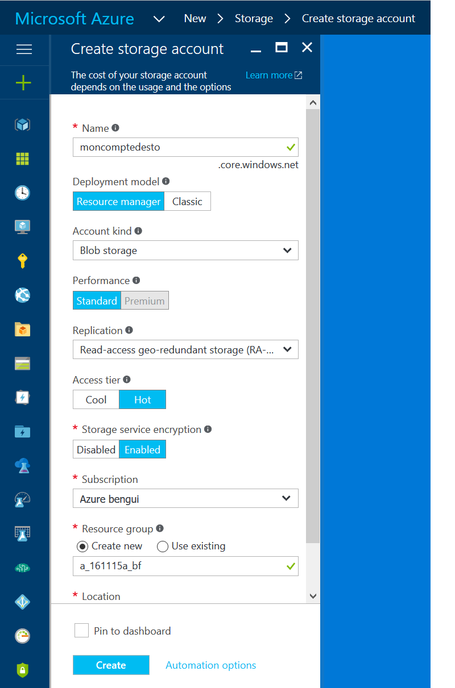

# blob storage

This page provides info on how blob storage that is relevant for the project

## introduction

We'll use Azure blob storage, block blobs.
The access tier may be hot or cool. The difference between the two is cost.

- <https://azure.microsoft.com/en-us/documentation/articles/storage-introduction/>
- <https://azure.microsoft.com/en-us/documentation/articles/storage-create-storage-account/>
- <https://azure.microsoft.com/en-us/documentation/articles/storage-blob-storage-tiers/>

## create a storage account

Here is an example: 

## Shared Access Signature

- <https://azure.microsoft.com/en-us/documentation/articles/storage-dotnet-shared-access-signature-part-1/>

## pricing

- <https://azure.microsoft.com/en-us/pricing/details/storage/blobs/>