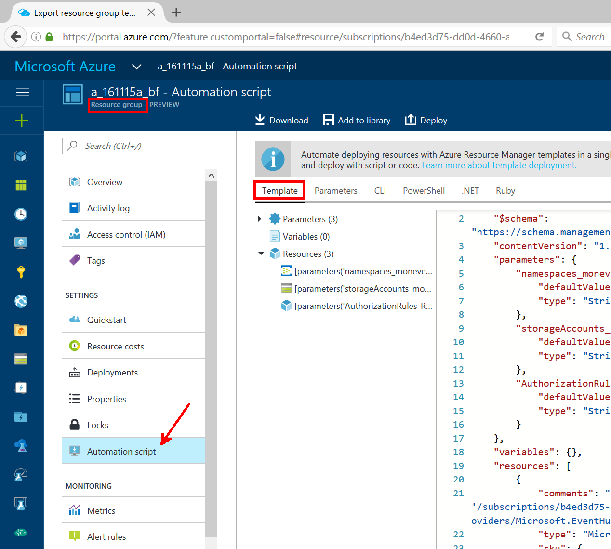

# General purpose info on Azure

## ARM

When choice is provided between ASM (Azure Service manager, or classic mode) and ARM (Azure Resource Manager), 
always prefer ARM which the new way of using Azure. 

more: 

- <https://azure.microsoft.com/en-us/search/?q=azure+resource+manager>
- <https://github.com/Azure/azure-quickstart-templates>

## portal

Most of the documentation contains automation scripts. 
The same may also be from the Azure portal available at <https://portal.azure.com>.

For existing resources, their automation can be generated by the portal. 
For instance, resource groups, contain an automation link like this one: 



The JSON you can see in the picture is an ARM template. 
The creation of the resources from an ARM template can be done by script. 

## Automation

### convention

by convention, in this repo, the following will be used

- all names starting with `tbr` should be replaced by your own
- the subscription id `59fed2e5-ccf2-4c40-9921-d96453f5f722` is fake and should be replaced by your own

### az

Sample code use the az command line tool. 

- announcement: <https://azure.microsoft.com/en-us/blog/announcing-azure-cli-2-preview/>
- how to install:  <https://github.com/Azure/azure-cli/blob/master/doc/preview_install_guide.md>
- Its GitHub repository: <https://github.com/azure/azure-cli>

more in `az.md`

### az and ARM templates

In order to deploy an ARM template in `$templateFilePath`, on can issue the following statement: 

```
az resource group deployment create --name $deploymentName --resource-group $resourceGroupName \
    --template-file $templateFilePath --parameters-file $parametersFilePath
```

the `$parametersFilePath` json file contains the values of the parameters required by the `$templateFilePath` JSON file. 

the `ExportedSampleResourceGroup` folder contains ARM template exported from the sample `tbrresgroup` resource group used in this documentation.  

## Azure Functions

They are used in the project to provide the robot with Shared Access Signatures, based on an authentication/authroization mechanism that is oversimplified in this repo.

more info on Azure Functions: 
- <https://docs.microsoft.com/en-us/azure/azure-functions/functions-overview>
- <https://azure.microsoft.com/en-us/pricing/details/functions/>
- <https://docs.microsoft.com/en-us/azure/azure-functions/functions-reference-csharp>
