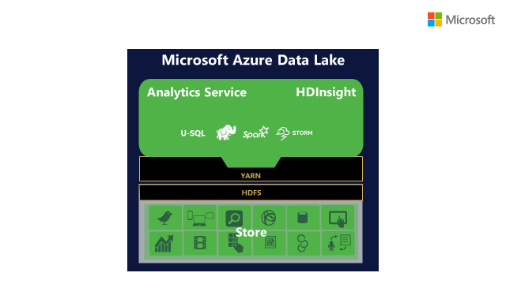
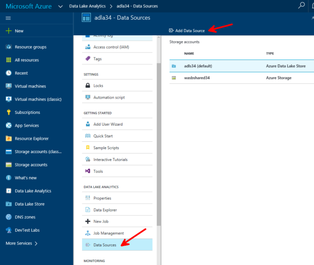
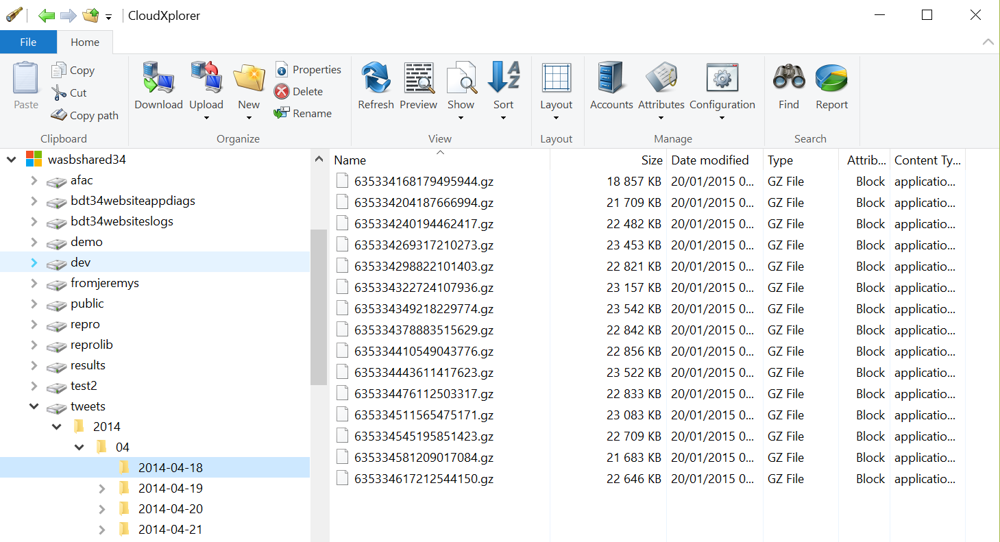
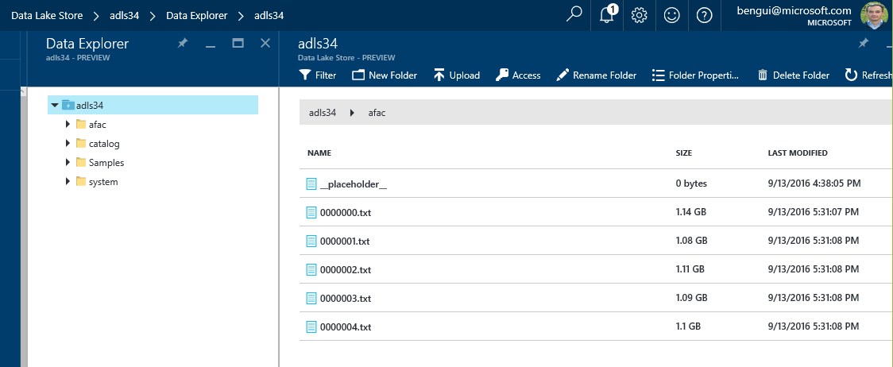
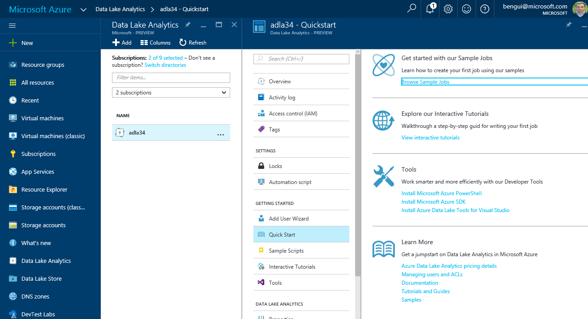
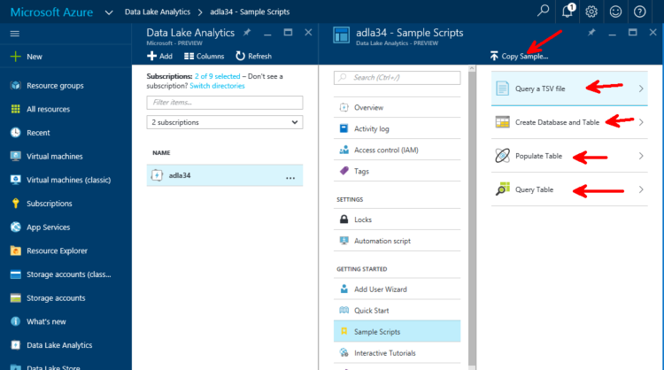

# Azure Data Lake

## introduction

Azure Data Lake Analytics is a serverless PaaS service that let you run distributed queries against distributed storage. 
It can access 2 types of storage:
- Azure Blob storage
- Azure Data Lake Store

Azure Data Lake Store is a storage like blob storage, but it is more specialized on big data workloads. 
For instance, it can be accessed thru a WebHDFS REST API.   

For now, Data Lake Analytics only supports a Microsoft specific language named U-SQL which is based on SQL Server's T-SQL and C#. 
The roadmap is to have other YARN workloads, but that's not the case yet.



If you're interested, you'll can find more, at <https://blogs.technet.microsoft.com/dataplatforminsider/2015/09/28/microsoft-expands-azure-data-lake-to-unleash-big-data-productivity/>.

Today, all regions are not deployed. In this sample, it is deployed in the following region: "East US 2".

The rest of the data is collected in the "West Europe" region, in an Azure Blob Storage. 
You may want to copy all or a part of the data to an Azure Data Lake Store in "East US 2" and you'll find how later on this page.  

## documentation

Here a few links to the documentation:

- [Azure Data Lake Analytics](https://azure.microsoft.com/en-us/services/data-lake-analytics/)
- [Data Lake Analytics documentation](https://azure.microsoft.com/en-us/documentation/services/data-lake-analytics/)
- [U-SQL Language Reference](https://msdn.microsoft.com/en-us/library/azure/mt591959.aspx)


## create an Azure Data Lake Analytics account

As stated in <https://azure.microsoft.com/en-us/documentation/articles/data-lake-analytics-get-started-portal/>, 

- Sign on to the [Azure Portal](https://portal.azure.com),
- Click New, click Data + Analytics, and then click Data Lake Analytics,
- fill in the blade
    - create a new resource group
    - configure/create a new Azure Data Lake Store

## copy data in Azure Data Lake Store

You can see how to use a command line tool (`AdlCopy`) that runs on Windows 10, or use an HDInsight cluster and use `distcp` in the Azure documentation, at
<https://azure.microsoft.com/en-us/documentation/articles/data-lake-store-copy-data-azure-storage-blob/>.

You can also run a query from Azure Data Lake Analytics that reads from your distant blob storage and stores the result in the local (East US 2) Azure Data Lake Store. 

### reference the blob storage account

In order to do that, you first need to provide your Azure Data Lake Analytics account with your Azure Blob storage credentials. 
For that, in <https://portal.azure.com>, select your Azure Data Lake Analytics account, select Data Sources, Add Data Source ... 



... and fill the blade: 
- Storage Type: Azure Storage
- Selection Method: Account Name
- Storage Account Name: *tbryourstorageaccountname*
- Account Key: *primary or secondary account key for tbryourstorageaccountname*

Then, click `Add`.

### execute a script

Here is an example of a U-SQL script that copies tweets from a blob storage where they are stored as gzipped JSON records to Azure Data Lake Store as text files. 

Source looks like this: 


The U-SQL script can be pasted in the <https://portal.azure.com>, thru `New Job` in the   

the script is

```
@tweets = 
    EXTRACT wholeLine string
    FROM @"wasb://tweets@wasbshared34.blob.core.windows.net/2014/07/2014-07-06/{*}.gz"
    USING Extractors.Text(encoding:System.Text.Encoding.UTF8, quoting:false, delimiter: '\n');

OUTPUT @tweets
    TO @"/afac/{*}.txt"
    USING Outputters.Text();
```

if your run it with a parallelism of 5, you get the following result in Azure Data Lake Store: 


## Do more with Azure Data Lake Analytics

In order to learn the basics of Azure Data Lake Analytics in a few minutes, you can go to your Data Lake Analytics account. 
In `GETTING STARTED`, there is a `Quick Start` blade: 



You can also use the Sample Scripts



First copy the samples, then execute the 4 sample scripts, in order.

If you want to see a video with the latest news on U-SQL, please refer to <https://channel9.msdn.com/Shows/Data-Exposed/U-SQL-Updates-Whats-New-and-Whats-Changed>.
