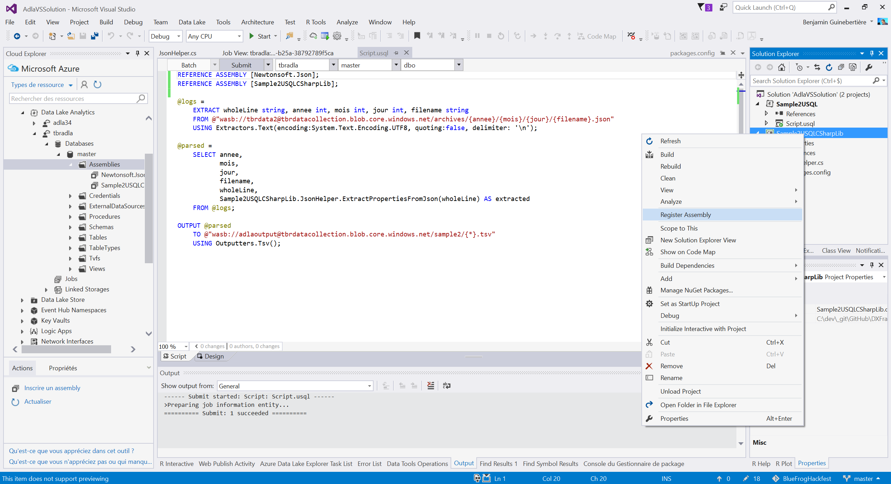

# Azure Data Lake

Please read the [Introduction of Azure Data Lake](AzureDataLake.md).

Here is how this can be used in the project.

## Sample1

`sample1.usql` how to have full text search in the logs.
cf <https://msdn.microsoft.com/en-us/library/azure/mt490418.aspx> for information on LIKE in U-SQL.

In Big Data, the schema is defined on read (vs on write in Business Intelligence). 
Here, the schema, is just a text file for each record, and we do a full text search on this text.

```
@logs = 
    EXTRACT wholeLine string, (...)
    FROM (...)
    USING Extractors.Text(encoding:System.Text.Encoding.UTF8, quoting:false, delimiter: '\n');
(...)
```

```
(...)
SELECT (...)
     WHERE wholeLine LIKE "%anomalies%Battery%";
(...)
```

## Sample2 

The `AdlaVSSolution` contains a Visual Studio solution with a Sample2 that can have an attached .NET assembly to extract additional properties from the messages.

This sample code in `JsonHelper.cs` shows how one could extract data from a base64 encoded field inside the JSON:

```
JObject data = JObject.Parse(jsonText);
```

(...)

```
try
{
    // nb of Bytes in the first command
    result.Append(
        System.Convert.FromBase64String(
            (string)data["commands"][0])
            .LongLength.ToString());
    result.AppendFormat(sep);
}
catch (Exception ex)
{
    result.AppendFormat("command[0] not extracted: {0}", ex.Message);
    result.Append(sep);
}
```


Here is a screen shot of Visual Studio, while registering the assembly in Azure Data Lake Analytics:



The execution will transform records like 

```
{"publisher":"D85DE2B3F32D","country":"France","city":"Paris","ipAddress":"42.42.42.42.41","commands":["HUJ1ZGR5T1MuQ29tbWFuZC5TZXRMYW5nU1RUQ21kAQEAAAAAAJgCCxYMEQvgBw==","HUJ1ZGR5T1MuQ29tbWFuZC5TZXRMYW5nVFRTQ21kAQEAAAAAAO0CCxYMEQvgBw==","IEJ1ZGR5T1MuQ29tbWFuZC5TZXRMYW5nU3BoaW54Q21kAQEAAAAAAPMCCxYMEQvgBw==","GEJ1ZGR5T1MuQ29tbWFuZC5FbXB0eUNtZDQBDxYMEQvgBw==","GEJ1ZGR5T1MuQ29tbWFuZC5FbXB0eUNtZDoBDxYMEQvgBw==","HUJ1ZGR5T1MuQ29tbWFuZC5TZXRNb29kTEVEQ21kAQEAAAAAAEABDxYMEQvgBw==","IUJ1ZGR5T1MuQ29tbWFuZC5TZXRXaGVlbHNTcGVlZENtZAH///9/AgAAUEIAAERCAEgBDxYMEQvgBw==","GEJ1ZGR5T1MuQ29tbWFuZC5FbXB0eUNtZFEBDxYMEQvgBw==","HUJ1ZGR5T1MuQ29tbWFuZC5TZXRNb29kTEVEQ21kAQEAAAAAAFYBDxYMEQvgBw==","IUJ1ZGR5T1MuQ29tbWFuZC5TZXRXaGVlbHNTcGVlZENtZAH///9/AgAAuEEAAIZCAFsBDxYMEQvgBw==","GEJ1ZGR5T1MuQ29tbWFuZC5FbXB0eUNtZGEBDxYMEQvgBw==","HUJ1ZGR5T1MuQ29tbWFuZC5TZXRNb29kTEVEQ21kAQMAAAAAAGYBDxYMEQvgBw==","IUJ1ZGR5T1MuQ29tbWFuZC5TZXRXaGVlbHNTcGVlZENtZAH///9/AgAAHEIAAIpCAGsBDxYMEQvgBw=="],"EventProcessedUtcTime":"2016-11-17T11:22:32.3294701Z","PartitionId":0,"EventEnqueuedUtcTime":"2016-11-17T11:22:32.5750000Z"}
```

into records like

```
2016	11	17	"0_7089288596ed4dac8d4209b6bf98d91c_1"	"{""publisher"":""D85DE2B3F32D"",""country"":""France"",""city"":""Paris"",""ipAddress"":""42.42.42.42.41"",""commands"":[""HUJ1ZGR5T1MuQ29tbWFuZC5TZXRMYW5nU1RUQ21kAQEAAAAAAJgCCxYMEQvgBw=="",""HUJ1ZGR5T1MuQ29tbWFuZC5TZXRMYW5nVFRTQ21kAQEAAAAAAO0CCxYMEQvgBw=="",""IEJ1ZGR5T1MuQ29tbWFuZC5TZXRMYW5nU3BoaW54Q21kAQEAAAAAAPMCCxYMEQvgBw=="",""GEJ1ZGR5T1MuQ29tbWFuZC5FbXB0eUNtZDQBDxYMEQvgBw=="",""GEJ1ZGR5T1MuQ29tbWFuZC5FbXB0eUNtZDoBDxYMEQvgBw=="",""HUJ1ZGR5T1MuQ29tbWFuZC5TZXRNb29kTEVEQ21kAQEAAAAAAEABDxYMEQvgBw=="",""IUJ1ZGR5T1MuQ29tbWFuZC5TZXRXaGVlbHNTcGVlZENtZAH///9/AgAAUEIAAERCAEgBDxYMEQvgBw=="",""GEJ1ZGR5T1MuQ29tbWFuZC5FbXB0eUNtZFEBDxYMEQvgBw=="",""HUJ1ZGR5T1MuQ29tbWFuZC5TZXRNb29kTEVEQ21kAQEAAAAAAFYBDxYMEQvgBw=="",""IUJ1ZGR5T1MuQ29tbWFuZC5TZXRXaGVlbHNTcGVlZENtZAH///9/AgAAuEEAAIZCAFsBDxYMEQvgBw=="",""GEJ1ZGR5T1MuQ29tbWFuZC5FbXB0eUNtZGEBDxYMEQvgBw=="",""HUJ1ZGR5T1MuQ29tbWFuZC5TZXRNb29kTEVEQ21kAQMAAAAAAGYBDxYMEQvgBw=="",""IUJ1ZGR5T1MuQ29tbWFuZC5TZXRXaGVlbHNTcGVlZENtZAH///9/AgAAHEIAAIpCAGsBDxYMEQvgBw==""],""EventProcessedUtcTime"":""2016-11-17T11:22:32.3294701Z"",""PartitionId"":0,""EventEnqueuedUtcTime"":""2016-11-17T11:22:32.5750000Z""}"	"V161117a|D85DE2B3F32D|46|"
```

in particular, the extracted values are at the end: `"V161117a|D85DE2B3F32D|46|"`.

