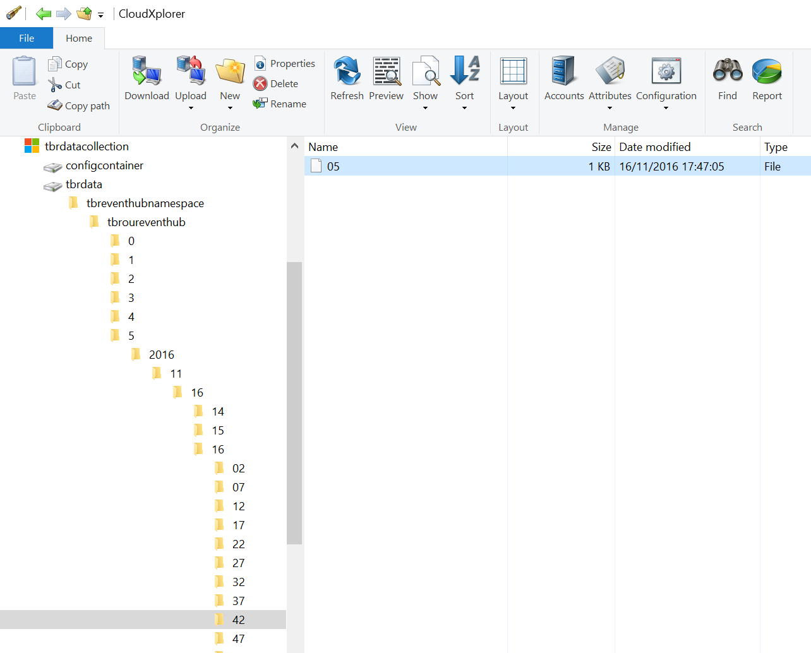

# sample data

The `05` file was extracted from Azure blob storage. It was copied from event hub by the archive feature.

Here is where it was in blob storage: 



Here is how the content of the file look like (approcimate encoding here):

```
Objavro.codecnullavro.schemaÞ{"type":"record","name":"EventData","namespace":"Microsoft.ServiceBus.Messaging","fields":[{"name":"SequenceNumber","type":"long"},{"name":"Offset","type":"string"},{"name":"EnqueuedTimeUtc","type":"string"},{"name":"SystemProperties","type":{"type":"map","values":["long","double","string","bytes"]}},{"name":"Properties","type":{"type":"map","values":["long","double","string","bytes"]}},{"name":"Body","type":["null","bytes"]}]} 4c-„I˜iC{cEJŒ> 0*11/16/2016 4:44:11 PMx-opt-publisherbuddy1234  P{"field1": "value1", "field2": "value2"}4c-„I˜iC{cEJŒ>
``` 

which could be reformatted as: 
```
Objavro.codecnullavro.schema
{
    "type":"record",
    "name":"EventData",
    "namespace":"Microsoft.ServiceBus.Messaging",
    "fields":
        [
            {
                "name":"SequenceNumber",
                "type":"long"
            },
            {
                "name":"Offset",
                "type":"string"
            },
            {
                "name":"EnqueuedTimeUtc",
                "type":"string"
            },
            {
                "name":"SystemProperties",
                "type": {
                    "type":"map",
                    "values":
                    [
                        "long","double",
                        "string","bytes"
                    ]
                }
            },
            {
                "name":"Properties",
                "type": {
                    "type":"map",
                    "values":
                    [
                        "long","double",
                        "string","bytes"
                    ]
                }
            },
            {
                "name":"Body",
                "type":["null","bytes"]
            }
        ]
    }
    
    { 0*11/16/2016 4:44:11 PMx-opt-publisherbuddy1234  
        P{"field1": "value1", "field2": "value2"}
    4c-„I˜iC{cEJŒ>
``` 

More in the `AzureDataLake` folder.