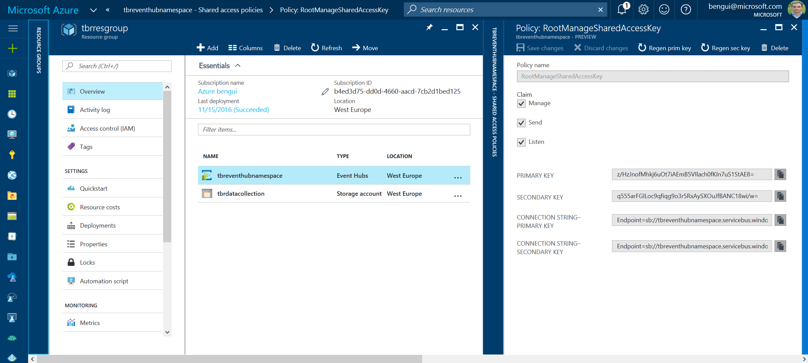

# Message collection

## Introduction

Messages are sent thru HTTPS to Event Hubs. 

Event Hubs can store data to blob storage. It can also be read by services like Azure Stream Analytics.
Azure Stream Analytics can then send data to [Power BI](http://powerbi.com).

## Event Hubs

It is interesting to have an automated way of creating the event hub because, in development, dropping it and crecreating it is the simplest / only way to empty it.

This is done in 2 phases: 
- create the namespace with `az`, and retrieve the connection string
- use the connection string to create the event hub with the correct values

In order to deploy the event hub in an automated way in the `$resourceGroupName`, get the files in the EventHub folder below, 
change the values in `parameters.json` and issue a command like the following: 

```
resourceGroupName=tbrresgroup
templateFilePath=template.json
parametersFilePath=parameters.json
deploymentName=deployment-v161116a

az resource group create --name $resourceGroupName --location 'West Europe'

az resource group deployment create --name $deploymentName --resource-group $resourceGroupName \
    --template-file $templateFilePath --parameters @$parametersFilePath

az resource group deployment show --name $deploymentName --resource-group $resourceGroupName --output jsonc
```

the latest command can return this kind of output, where you'll get the value of the 


```
{
  "id": "/subscriptions/b4ed3d75-dd0d-4660-aacd-7cb2d1bed125/resourceGroups/tbrresgroup/providers/Microsoft.Resources/deployments/deployment-v161116a",
  "name": "deployment-v161116a",
  "properties": {
    "correlationId": "abb590ad-1f1d-45f0-b935-2ae58f67a521",
    "debugSetting": null,
    "dependencies": [],
    "mode": "Incremental",
    "outputs": {
      "namespaceConnectionString": {
        "type": "String",
        "value": "Endpoint=sb://tbreventhubnamespace2.servicebus.windows.net/;SharedAccessKeyName=RootManageSharedAccessKey;SharedAccessKey=z/HzJnofMhkj6uOt7iAEmB5VIlach0fKIn7uS1StAE8="
      },
      "sharedAccessPolicyPrimaryKey": {
        "type": "String",
        "value": "z/HzJnofMhkj6uOt7iAEmB5VIlach0fKIn7uS1StAE8="
      }
    },
    "parameters": {
      "eventHubNamespaceName": {
        "type": "String",
        "value": "tbreventhubnamespace"
      }
    },
    "parametersLink": null,
    "providers": [
      {
        "id": null,
        "namespace": "Microsoft.EventHub",
        "registrationState": null,
        "resourceTypes": [
          {
            "aliases": null,
            "apiVersions": null,
            "locations": [
              "westeurope"
            ],
            "properties": null,
            "resourceType": "namespaces"
          }
        ]
      }
    ],
    "provisioningState": "Succeeded",
    "template": null,
    "templateLink": null,
    "timestamp": "2016-11-16T10:44:17.226378+00:00"
  },
  "resourceGroup": "tbrresgroup"
}
```

The management key can also be retrieved from the portal: 



This allows to fill the app.config for the C# console app `DropCreateDevEventHub` in the Visual Studio solution (cf EventHubVSSolution in this repo).

Extract from the `App.config`:

```
    <appSettings>
      <!-- Service Bus specific app setings for messaging connections -->
      <add key="eventHubNamespaceConnectionString"
        value="Endpoint=sb://tbreventhubnamespace.servicebus.windows.net;SharedAccessKeyName=RootManageSharedAccessKey;SharedAccessKey=z/HzJnofMhkj6uOt7iAEmB5VIlach0fKIn7uS1StAE8="/>
      <add key="eventHubName" value="tbrOurEventHub"/>
      <add key="eventHubManagePrimaryAndSecondaryKey" value="JEo0REVoyDH7dinK07SFWnKcfrypACrICs1de2hZSvU=" />
      <add key="eventHubListenPrimaryAndSecondaryKey" value="hdlgUXDJhRvfgfErbM82Sb/HWpk2NW2+7SlYMtBRoTA=" />
      <add key="eventHubSendPrimaryAndSecondaryKey"   value="clnIRs4nBh1Pb7VvOUkKDg74xWV8bC0gPElKq8jrUI0=" />
      <add key="eventHubStporageDestinationConnectionString" value="DefaultEndpointsProtocol=https;AccountName=tbrdatacollection;AccountKey=kjCcNxtjDMCaXLkDtl5MPyEYTfSaZm4YNGHnLGq8zx+KlB+NgCf/ivahtXGFm0QwjaulI3UuBUJjMUOKGFsxjw==" />
      <add key="eventHubStporageDestinationContainer"        value="tbrdata" />
    </appSettings>
```

The `eventHubNamespaceConnectionString` app setting can be retrieved from the output of the event hub namespace deployment, or from the portal as shown before. 

The `eventHubStporageDestinationConnectionString` can be constructed from the primary (or secondary) key of a blob storage account.

The other parameters can be changed but the don't depend on the event hub namespace deployment. 

The easiest way to create new keys, is to regenerate existing keys on an event hub in the portal.
