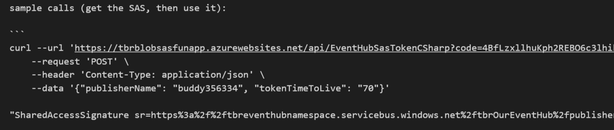

# Message collection

## Introduction

Messages are sent thru HTTPS to Event Hubs. 

Event Hubs can store data to blob storage (not used here). It can also be read by services like Azure Stream Analytics.
Azure Stream Analytics can then send data to [Power BI](http://powerbi.com).

## from the robot to Power BI

The following has been put in place:

- the robot sends data to Event Hub
    - the robot get a SAS token (here is an example in curl: ) which is given by an Azure function: 
        - the function has the event hub management key:  
        - the data is sent thru a Web Request too, from unity
            - here is the equivalent in curl: 
    - the data is received by Azure Event Hub: 
    - it is then processed by Azure Stream Analytics:  
    - Azure Stream Analytics sends 
        - a copy of all the data to blob storage 
            - the data can be searched with Azure Stream Analytics:     
        - a summary of the data to Power BI 
